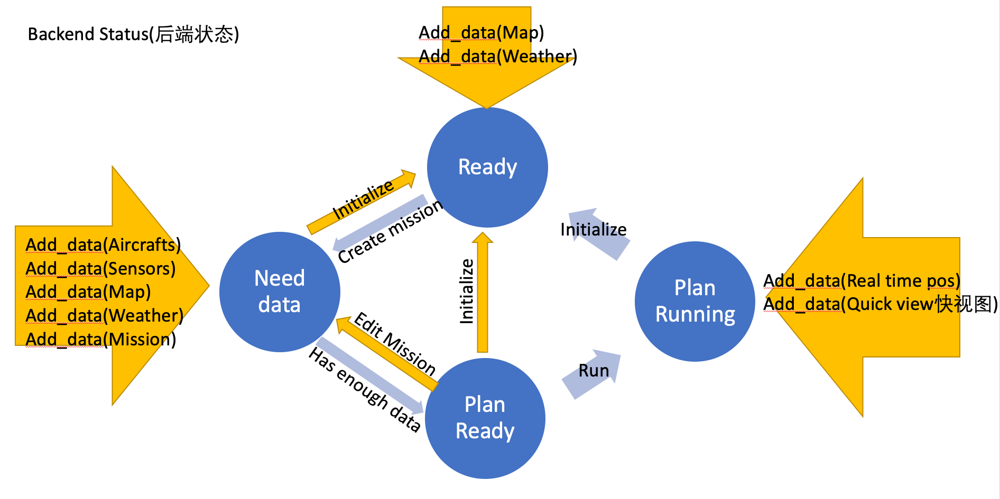

# 任务规划软件状态


### Ready
```
状态描述: 没有创建任务的最初状态
前端显示: 已有的地理数据/天气数据
可以执行的操作: create_mission, add_data(地理/地图/台站/天气)
```
### Need data
```
状态描述: 已经创建任务,但信息不足作出任务规划
前端显示: 已有的地理数据/天气数据, 已有的飞机/传感器数据, (可选: 显示缺失哪些数据)
可以执行的操作: add_data(地理/地图/台站/天气), add_data(飞机/传感器)
```
### Plan ready
```
状态描述: 任务规划完成,还没开始飞
前端显示: 已有的地理数据/天气数据, 已有的飞机/传感器数据, 任务模拟显示
可以执行的操作: run
```
### Plan running
```
状态描述: 正在飞
前端显示: 各种数据, 快视图, 飞行模拟
可以执行的操作: add_data(real_time_pos), add_data(quick_view_image)
```
